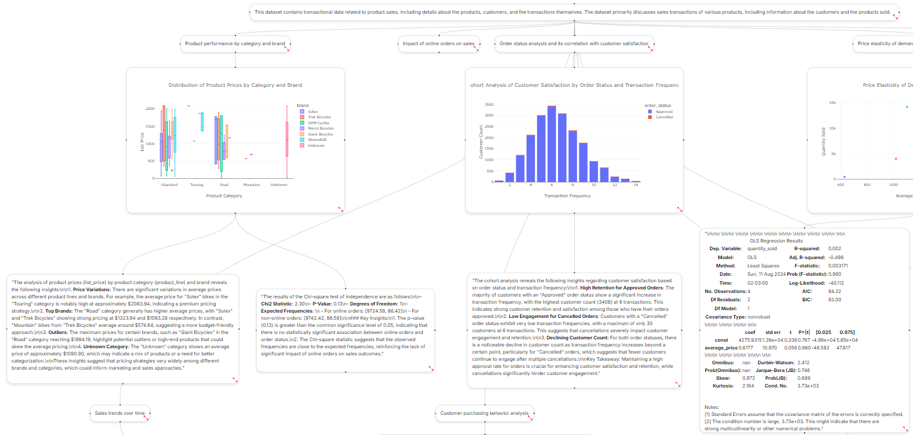

# Marat - Data Analysis Using LLM-Based Agents



Marat is a data analysis and visualization tool using a NextJS flowchart-style frontend to visualize and coordinate data analysis through python-based Langgraph agents. Simply upload your CSV file into when prompted, and as specific questions (i.e. Generate a linear regression between size and cost) or a broad question (i.e. Tell me everything, What contributes to changes in price, etc.). 

## Features
- **Broad range of analysis options**: Regression analyses, plotly visualizations, cluster analyses, etc.
- **Report generation**: Selecting the nodes you are interested in and click "Generate Review from Selected Nodes" (reports will appear in the "Reports" page)
- **Node layouts**: Select "Vertical Layout" or "Horizontal Layout" to automatically realign inserted nodes, or move them around to your liking
- **Code Review**: Select the "Show Code" expander to reveal the Python code used to render any analysis
- **SVG Export**: If you want to save your visualized analyses, select "Export to SVG"

## File Structure
All frontend NextJS code is located in the 'nextjs' folder. Presently, typescript is not set in script mode, but I am planning on updating this once all type configurations are fully added.

The langgraph and agent configurations can be found in the backend folder, with the agent definitions and graph configuration found in backend->api->agents->[agents.py](backend/api/agents/agents.py) and backend->api->agent_graph->[graph.py](backend/api/agent_graph/graph.py) respectively. 
FastAPI backend setup is in backend->api->[test.py](backend/api/test.py), with the coordination of the langgraph responses being found in langchain_base->langchain.py. 
Model configurations can be found in the backend->api->[models](backend/api/models/) directory. All prompts are located in backend->api->prompts->[prompts.py](backend/api/prompts/prompts.py)

Much of the schema and implementation comes from [this project](https://github.com/john-adeojo/graph_websearch_agent/tree/main), which also features some great learning material. 


## Installation
### Docker
The easiest way to install and get started is through Docker. You can either pull the pre-built image or build the image locally. 

**Pull the Docker image from DockerHub**

1. To get the most recent version of the nextjs and python backend images: 
    ```bash
    docker pull nbritt27/marat-agent-data-analysis:frontendv1.0
    docker pull nbritt27/marat-agent-data-analysis:backendv1.0
    ```
2. To run the frontend image:
    ```bash
    docker run -p 3000:3000 --name marat-frontend -d marat-agent-data-analysis:frontend
    ```
3. To run the backend image, you will have to provide your own OpenAI API key. This can be done as a keyword argument: 
    ```bash
    docker run -p 8000:8000 --name marat-agent-data-analysis-backend -d \
    -e OPENAI_API_KEY=your_api_key \
    marat-agent-data-analysis-backend:v1.0
    ```
**Build the image locally**

1. Clone the repository 
    ```bash
    git clone https://github.com/nbritt27/marat-agent-data-analysis.git
    cd marat-agent-data-analysis
    ```
2. Copy the env.example into your .env file
    ```bash
    cp .env.example .env
    ```
3. Replace the environment variables with your API keys
4. Compose the local image
    ```bash
    docker compose up
    ```
### Running without Docker
Assuming you have Node installed (this project uses Node 20.12.0):
The project uses a NextJS frontend, with NextJS installation instructions being found at [https://nextjs.org/docs/getting-started/installation](https://nextjs.org/docs/getting-started/installation)

1. Move into the nextjs directory
    ```bash
    cd nextjs
    ```
2. Install all nextjs and node dependencies
    ```bash
    npm install
    # or
    pnpm install
    ```
3. Install pip dependencies
    ```bash
    pip install -r ../backend/requirements.txt
    ```

4. To run the project
    ```
    npm run dev
    ```

    NOTE: If you are using Windows, and want to generate reports, you will have to download the installer for wkhtmltopdf [https://wkhtmltopdf.org/downloads.html](https://wkhtmltopdf.org/downloads.html), and specify the executable path in env file. 


This project does execute generated Python code. Running the project inside of a virtual environment or container is recommended. 

## Project Trajectory
### Short-Term
- Enable session storage (likely through a Postgres endpoint with NextJS Authentication)
- Update agent configurations (more agents=more functionality), and specialization for certain types of analysis
- Options to ask follow-up questions or analysis request on particular nodes
- Incorporation of multiple LLM providers (OpenAI is the only one that has been extensively tested)
### Mid-Term
- Ability for users to add in their own nodes with custom analyses or insights
- Support for more file types
- Implement a GraphRAG system for handling text data and analysis
- Chain of thought reasoning and meta-prompting for certain agent directives
### Long-term
- Ability to upload entire reports/manuscripts and convert them into their own flow that can be modified
- Tools to automate expansion of existing analyses
- Incorporation of additional research tools to fast-track analysis planning and manuscript creation
## Known Bugs
- Frontend
    - Occasionally, the page will load and the "Choose file" dialog is inoperable. Refreshing the page normally resolves this issue
    - Occasionally, submitting the chosen file will return you to the "Choose file" option. Simply choosing the file again works the second time
    - Text elements, such as code and insights, are not presently able to be highlighted and copied. This seems to be an issue with certain DOM elements being presented to mouse events above them, and I am working on a solution.
    - When dealing with certain tables, the SVG export will encounter an error
- Backend
    - Occasionally, the LLM Coder will attempt to print the plotly figure, which is then added in text form as a node
    - Occasionally, the LLM Coder will export its output back into its own call to the completions endpoint, often resulting in a > max tokens request. The present implementation allows a maximum of three retries, with one generally being sufficient. 
 
## Contribute/Contact
I would love assistance in working on this project. If you're interested in assisting with the project, or have any other questions or concerns, the best way to reach me is by email at [nbritt27@gmail.com](mailto:nbritt27@gmail.com)


## License

This project is licensed under the MIT License - see the [LICENSE](./LICENSE) file for details. 

If you use this project or any subset of it, please let me know! I'd love to see what you're able to create :)